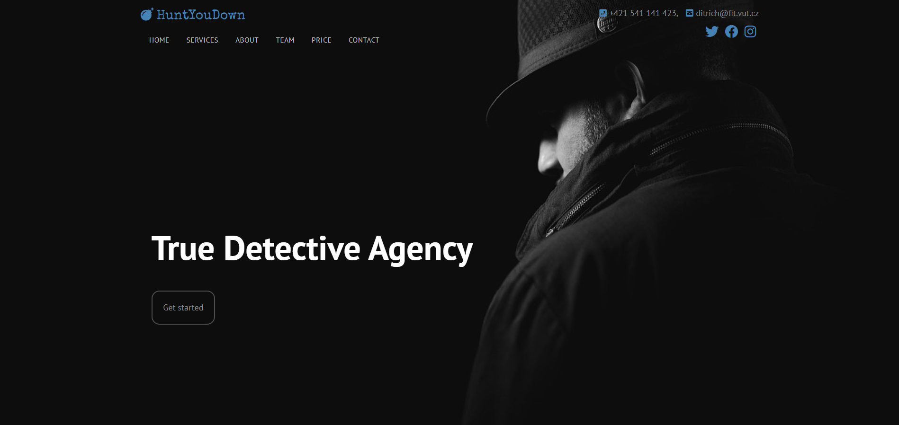

# ITW Project
Cílem projektu je vyzkoušet si základní znalosti jazyka CSS, jednotlivých CSS pravidel a schopnost aplikovat různé typy CSS selektorů.
## What is ITW?
You can learn more about the course [here](https://www.fit.vut.cz/study/course/244890/.cs)
## Preview
 
## Project task [CZ]
### #header (záhlaví)
> výška: velikost viewportu, ale minimálně 400px
### menu:
> horní okraj: 10px
### logo:
> písmo: 25px  
> vzdálenost mezi položkami menu: 10px  
### navigace:
> písmo 13px  
> mezera mezi písmeny: .05em  
> vycpávka: 5px vertikální a 15px horizontálně  
> rámeček: 1px
### hlavní nadpis:
> písmo: 64px, white  
> odsazení zespodu a zleva: 20px  
> tlačítko Get started:  
> větší písmo  
> vycpávka: 20px  
> rámeček: 2px  
> zaoblení: 15px  
> hlavní nadpis spolu s tlačítkem umístěn v 2/3 záhlaví
### #services
> šířka karty: 300px  
> mezera mezi kartami: 40px  
### rámeček s ikonou:
> velikost: 50px  
> vycpávka: 5px  
> čára rámečku: 1px  
> implementujte styly tak, aby bylo možné přidat další elementy .services-column
### #about
> velikost obrázku: 40%, 50% (po najetí kurzoru)  
> mezera mezi obrázkem a odstavcem: 40px (vertikální), 80px (horizontálně)  
> implementujte styly tak, aby bylo možné přidat další elementy .about-item a obrázky se pozicovaly  střídavě na levou a pravou stranu
### #team
> karty mají stejnou šířku  
> mezera mezi kartami: 20px
### #stats
> karty mají stejnou šířku  
> maximální šířka karty: 300px  
> minimální mezera mezi kartami: 20px  
> velikost písma ikonky: 32px
### #price
> šířka tabulka: 80%  
> mezera mezi řádky 20px  
> vycpávka řádku: 20px  
> vycpávka tlačítka: 20px
### #refs
> karty mají stejnou šířku  
> maximální šířka karty: 400px  
> velikost obrázku: 60px
### #contact
> výška mapy: 400px  
> mezera mezi vstupními položkami: 20px  
> vycpávka vstupních položek: 10px  
> text nevalidního vstupu: red  
> barva tlačítka po najetí kurzorem: green 
### #footer 
> horní a spodní odsazení sekce: 40px  
> Vlastnosti, které nejsou výše specifikovány se pokuste odhadnout z uvedených snímků (není nutné, > aby bylo na pixel přesné - viz. pozn. #2)
## Results
`19 / 20`

